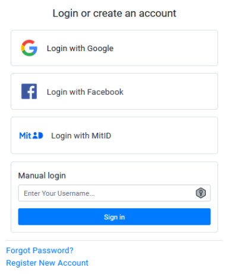

# MitID_Django_integration

Django authentication component for integrating Danish MitID authentication, OAuth 2.0, and two-factor authentication.

This repository demonstrates how to integrate multiple authentication methods in Django.

## Included Authentication Methods

- MitID Django integration for the Danish digital citizen ID.
- Social account identification using OAuth 2.0 and `django-allauth`.
- Two-factor authentication with one-time passwords from mobile authenticator apps, such as Google Authenticator and Microsoft Authenticator.
